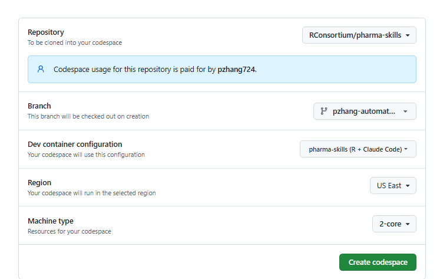

## 1. Create a codespace from Github 
open https://github.com/codespaces and create a codespace under main from pharma-skills



Note that you should choose main as the screenshot is made before the PR is accepted.

Then you will see clouds-based VS code. While selecting 2 core, you can use 60 hours per month free.

Select the main branch. As you have notified that a folder of .devcontainer/ is created. This pre-build the environment has:

1) R 
2) required R packages,
3) Claude Code CLI
4) Github CLI by default
5) igraph
6) python-docx

This will help save the session time from Claude Code.

The installation time by expecation should be less or around 10mins.

We previously experience a hard time in Claude Code in Claude.ai for routine, where it didnt perform as expected (not starting up, installation failed, etc.)

## 2. login to Github Through CLI; This will ensure you can push your automated report to Github Issues

```
unset GITHUB_TOKEN
gh auth login
```
Login using token or authorization 

##  3. Start Claude Code using dangerous mode. 

Note that we are in the sandbox mode and can utilize this mode to enable agent to do most of things, so that we don't confirm manually 

```
claude --dangerously-skip-permissions
```
Then login your claude account


##  4. Implement Below 

```
Read the skill instructions from the file at the path below, then execute them exactly:
File: ./_automation/benchmark-runner-codespaces/SKILL.md

```


