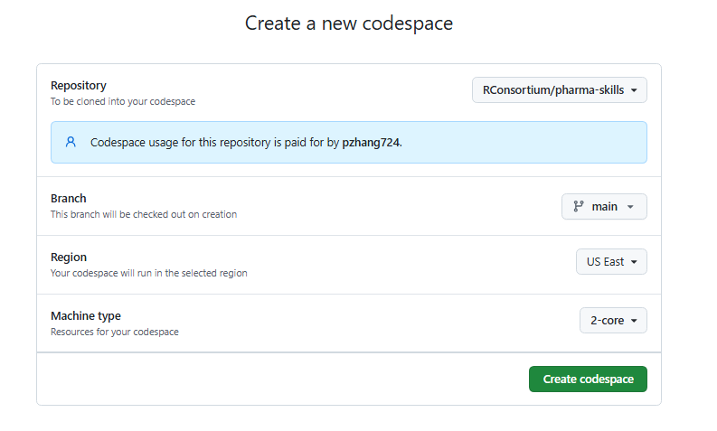

## 1. Create a codespace from Github 
open https://github.com/codespaces and create a codespace under main from pharma-skills



Then you will see clouds-based VS code. While selecting 2 core, you can use 60 hours per month

## 2. Download Claude Code onto this machine

Find Terminal and run below
```
curl -fsSL https://claude.ai/install.sh | bash
```
## 3. login to Github Through CLI; This will ensure you can push your automated report to Github Issues

```
unset GITHUB_TOKEN
gh auth login
```
Login using token or authorization 

## 4. Start Claude Code using dangerous mode. 

Note that we are in the sandbox mode and can utilize this mode to enable agent to do most of things, so that we don't confirm manually 

```
claude --dangerously-skip-permissions
```

### Below as to do, not finished
## Prompt 

```
Read the skill instructions from the file at the path below, then execute them exactly:
File: ./_automation/benchmark-runner-codespaces/SKILL.md

```
